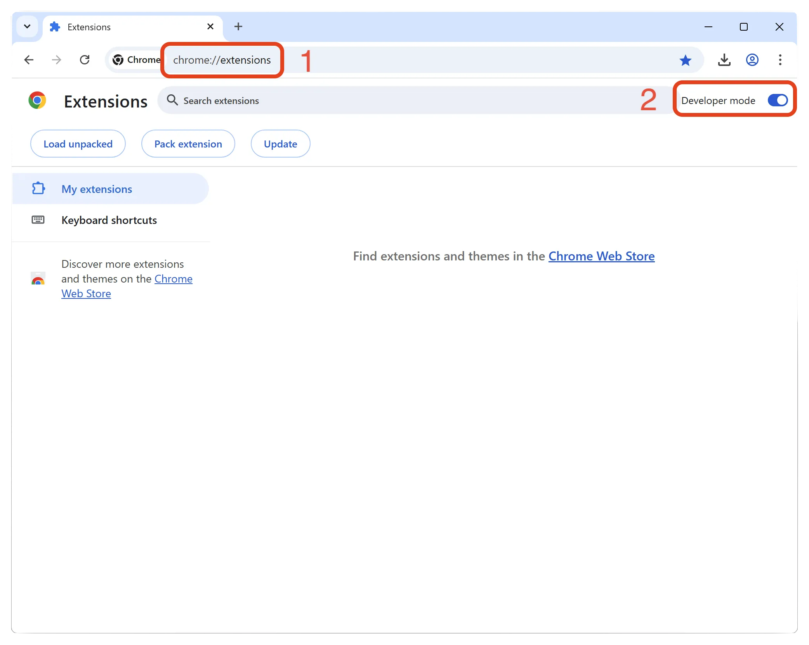

> **Note:** This extension is currently **not available on the Chrome's Web Store**. You will need to install it manually using folllowing steps. The manual installation process takes less than 2 minutes.

## How to Download and Install This Extension

### 1. Download Extension
Click the button below to download the extension package (.zip file).

**[Download v1.0](https://github.com/user-attachments/files/21320760/social_media_blocker.zip)**

---

### 2. Extract ZIP File
After downloading, locate the ZIP file and extract its contents to get the extension files

- Right-click the ZIP file and select "Extract All"
- Choose a destination folder and click "Extract"
- You'll see the extracted files (public folder)

---

### 3. Enable Developer Mode
- Go to `chrome://extensions/` in Chrome.
- Enable "Developer mode" in the top right corner.

---

### 4. Drag to Install
- Drag the extracted public folder onto the extensions page of chrome and click "Add extension" when prompted.

Then you will something like - 

You're done!!